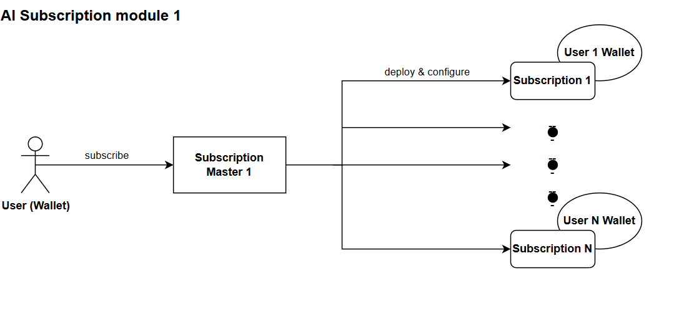
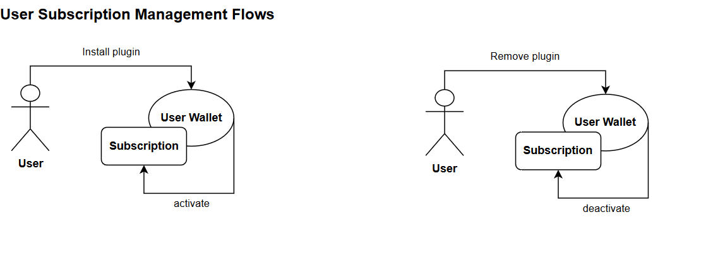
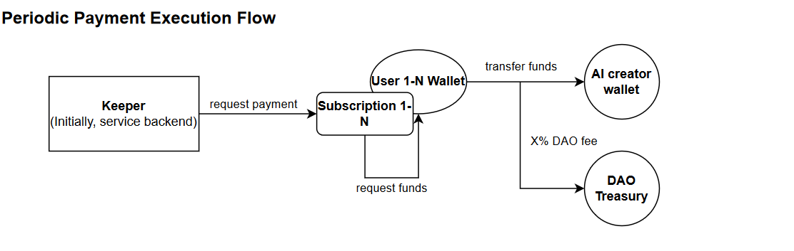

# Agora Subscription Contracts

## Description
This repository contains the contracts associated with the Agora AI subscription. The Subscription Master contract holds descriptive information about the service (metadata), the manager (can change subscription configuration and request for payments) and other information related to the fees requested by the service. The Subscription contract serves as a payment between the service creator and the user wallet.

## Architecture Overview
Each AI service present in the Agora Marketplace will be bound to a Subscription Master contract. In order for the user to get access to the service, the user will need to subscribe to it. 

*User subscription flow: Each user will be associated to a different subscription contract to distribute message load*

After subscription, one more step is necessary by the user, install the plugin (give permission to subscription contract to subtract funds from it). Note that an `activation_fee` will be charged for the first time, after that the user will be charged a smaller `period_fee`.

If the the user doesn't wanna make use of the service anymore, a remove plugin operation can be performed on the user wallet (deactivating the subscription contract).  
**Notice**: If the user wishes to activate the service again, the `activation_fee` will need to be paid once again.

*User needs to activate subscription to use the service and deactivate to seize payments, losing access to the service*

Lastly, Agora Keeper will maintain the subscriptions, by caching and managing on-chain user data and request payments from subscriptions periodically and automatically for AI creators.

*Agora Keeper requests payments from all subscriptions associated with all services bound by a Subscription Master*

## Project structure

-   `contracts` - source code of all the smart contracts of the project and their dependencies.
-   `wrappers` - wrapper classes (implementing `Contract` from ton-core) for the contracts, including any [de]serialization primitives and compilation functions.
-   `tests` - tests for the contracts.
-   `scripts` - scripts used by the project, mainly the deployment scripts.

## How to use

### Build

`npx blueprint build` or `yarn blueprint build`

### Test

`npx blueprint test` or `yarn blueprint test`

### Deploy or run another script

`npx blueprint run` or `yarn blueprint run`

### Add a new contract

`npx blueprint create ContractName` or `yarn blueprint create ContractName`

## Architecture

# License
MIT
